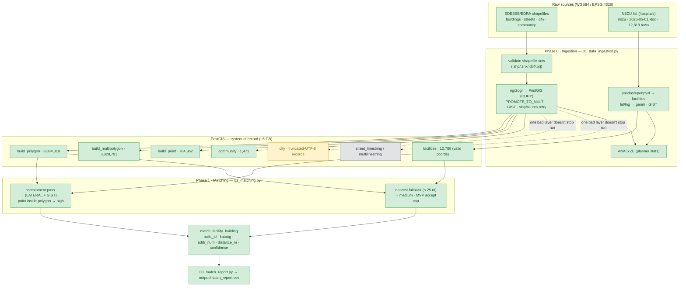
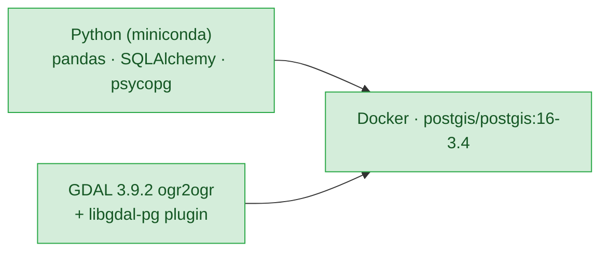

# Pipeline — what's built so far

> Status: Draft v1 · Last updated: 2026-06-22
> Scope: Phase 0 (ingestion) + Phase 1 (establishment↔building matching) of
> `roadmap.md`, for the **hospital MVP**. Code in `../02_code`.

This is a snapshot of the data workflow that has actually been implemented and
run, not the target architecture (that's in `tech-stack.md`).

## Workflow



**Legend:** 🟩 done & loaded · 🟨 partial / known issue · ⬜ pending (not on the
MVP matching path).

## Phase 1 result (hospital MVP)

**MVP accepts only `high` (contained) and `medium` (nearest ≤ 25 m) matches.**

| Match type | Confidence | Count | Avg dist |
| --- | --- | --- | --- |
| contained (point inside polygon) | high | 3,443 | 0 m |
| nearest ≤ 25 m | medium | 3,657 | 9.6 m |
| **Accepted (MVP)** | | **7,100 (55.5%)** | |
| **Unmatched** | | **5,688 (44.5%)** | |

Of 12,788 hospital divisions with valid coordinates. (A looser 25–50 m "low"
band would add ~1,214 more at lower confidence, but it is **excluded** from the
MVP.) The 44.5% unmatched is the next thing to investigate — likely a mix of
rural addresses with no mapped footprint in the **addressed** `build_polygon`
layer, approximate/centroid coordinates, and the 25 m cap. Candidate
improvements: add the Microsoft-footprint layer (`build_multipolygon`, 3.3M) as
a fallback target, and analyze the unmatched set by region / coordinate source.

## Environment (local, verified working)



- The conda GDAL ships the live **PostgreSQL** driver as a separate
  `libgdal-pg` plugin off GDAL's default path; it's wired via `GDAL_DRIVER_PATH`
  (auto-detected in `config.py`).
- Encoding verified: Ukrainian Cyrillic reads cleanly as UTF-8 from the `.cpg`.

## Known issues / not yet done

| Item | State | Note |
| --- | --- | --- |
| `city` layer | partial | Many `city_name` values are truncated at the DBF field width, cutting Cyrillic mid-character → invalid trailing UTF-8. Not on the MVP path; needs a repair/recode step before loading. |
| `street_*` layers | pending | Load the same way; not required for hospital matching. |
| Match-rate thresholds | open | Confidence cutoffs (50 m / 25 m) are provisional; tune after reviewing `match_report.csv`. |
| Run end-to-end as one script | pending | Ingestion now continues past bad layers and ANALYZEs; a single `make`/runner can chain 01→02→03. |

## Run order

```
docker compose up -d          # PostGIS
python 01_data_ingestion.py   # sources → PostGIS (+ validate, ANALYZE)
python 02_matching.py         # facilities → buildings → match_facility_building
python 03_match_report.py     # quality metrics → output/match_report.csv
```

## Bridge to the serving app (Phase 2)

The ~6 GB ETL DB above stays offline. The deployed app (`../02_code/app/`) runs
on a **lean serving DB** built from just three tables:

```
bash scripts/export_serving_tables.sh   # facilities + match_facility_building
                                         #  + community  →  app/serving-data/serving.sql (~72 MB)
cd app && cp .env.example .env && docker compose up -d --build
```

The app's PostGIS container restores that dump on first init; FastAPI serves it
read-only behind Caddy. Architecture/decisions are in `tech-stack.md` §7; the
run/deploy runbook is in `../02_code/app/README.md`. Optional one-time building
PMTiles: `scripts/build_building_tiles.sh`.
